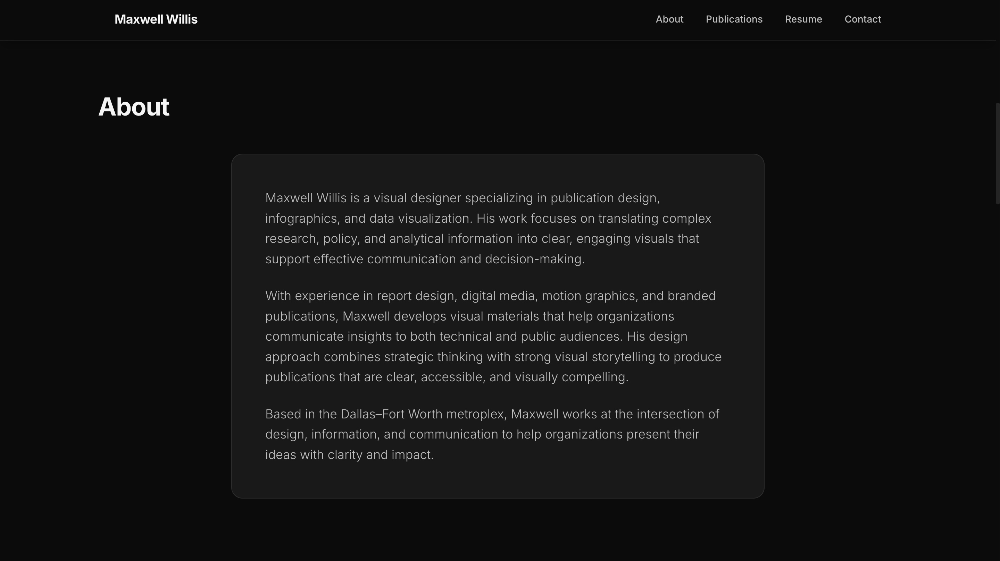
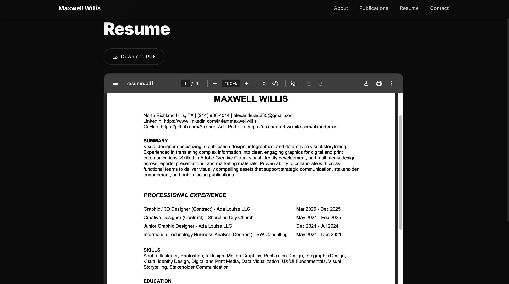
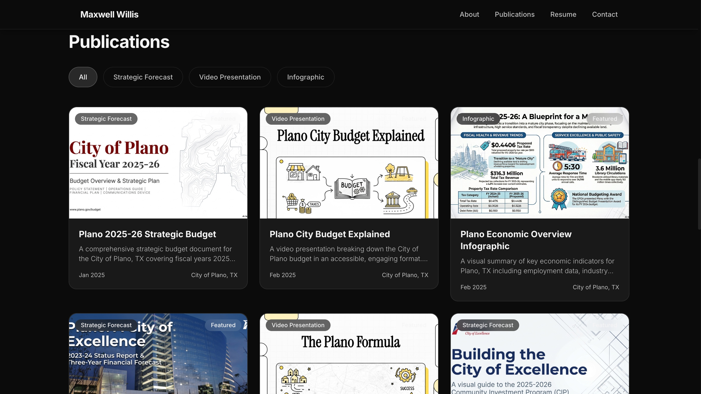

# Publication Graphics Portfolio

A curated portfolio of publication-ready visual design, data storytelling, and presentation graphics created for internal reports, executive presentations, and public-facing publications.

This portfolio highlights my ability to transform complex information into clear, compelling visual communication for stakeholders, decision makers, and the public.

**Live Portfolio:**
[https://publication-portfolio.vercel.app](https://publication-portfolio.vercel.app)

---

## Screenshots

### About


### Resume


### Publications


---

## Overview

This repository contains examples of publication graphics, report visuals, presentation slides, and editorial design layouts that demonstrate my approach to:

- Data visualization
- Visual storytelling
- Publication layout design
- Government and enterprise reporting graphics
- Executive presentation design

The goal of this portfolio is to showcase work that helps organizations communicate insights clearly and effectively through design.

---

## What This Portfolio Demonstrates

### Visual Communication

Transforming complex datasets, reports, and analysis into clear, intuitive visual graphics that communicate key insights quickly.

### Publication Design

Designing layouts and graphics suitable for:

- Government reports
- Annual reports
- Policy publications
- Executive briefings
- Public communications

### Data Storytelling

Combining design, typography, and visual hierarchy to guide readers through information and highlight the most important insights.

### Presentation Graphics

Designing slides and supporting visuals for leadership briefings and stakeholder presentations.

---

## Skills Demonstrated

### Design

- Publication Graphics
- Editorial Layout
- Visual Hierarchy
- Typography
- Color Theory
- Brand Alignment

### Data Visualization

- Charts and Graphs
- Infographic Design
- Report Visuals
- Data Storytelling

### Tools

- Adobe Illustrator
- Adobe InDesign
- Figma
- Canva
- PowerPoint
- Google Slides

### Web Portfolio

- Next.js
- Vercel Deployment
- Responsive Layout Design

---

## Portfolio Sections

The portfolio includes examples of:

### Publication Graphics

Visual elements designed for reports, publications, and printed materials.

### Data Visualization

Charts, graphs, and infographic-style visuals that translate raw data into meaningful insights.

### Report Design

Examples of page layouts and graphics used within structured reports.

### Presentation Graphics

Slides and visuals designed to support executive briefings and stakeholder presentations.

---

## Why This Portfolio Matters

Clear visual communication is critical when presenting information to leadership, policymakers, and the public.

This portfolio demonstrates my ability to:

- Translate complex information into clear visual narratives
- Design graphics that support data-driven decision making
- Create professional, publication-quality visuals
- Align graphics with organizational branding and communication standards

---

## Live Portfolio

Explore the full portfolio here:

[https://publication-portfolio.vercel.app](https://publication-portfolio.vercel.app)

---

## Repository Structure

```
publication-portfolio
│
├── src/
│   ├── app/
│   │   ├── page.tsx
│   │   ├── layout.tsx
│   │   ├── publications/
│   │   └── resume/
│   ├── components/
│   ├── data/
│   ├── hooks/
│   └── types/
│
├── public/
│   ├── publications/
│   └── resume/
│
└── README.md
```

---

## Running the Project Locally

**Clone the repository**

```bash
git clone https://github.com/AlxanderArt/publication-portfolio.git
```

**Install dependencies**

```bash
npm install
```

**Run the development server**

```bash
npm run dev
```

**Open in your browser**

```
http://localhost:3000
```

---

## Deployment

This portfolio is deployed using [Vercel](https://vercel.com), allowing fast global delivery and seamless integration with Next.js.

---

## Author

**Maxwell Willis**

Visual Designer | Data Storytelling | Publication Graphics

- [LinkedIn](https://linkedin.com/in/iammaxwellwillis)
- [GitHub](https://github.com/AlxanderArt)
- [Portfolio](https://publication-portfolio.vercel.app)

---

## License

This repository is for portfolio and demonstration purposes.
